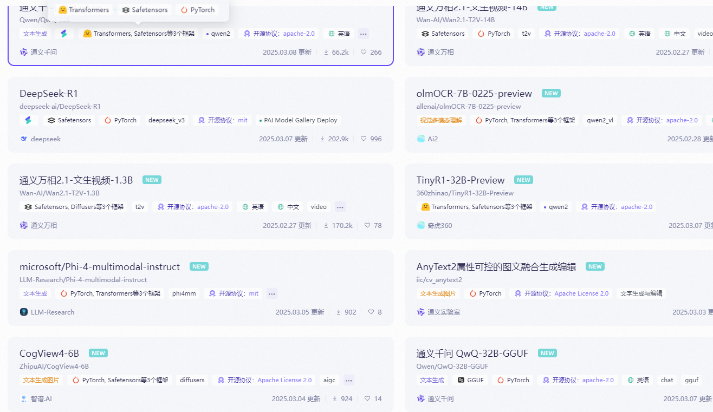
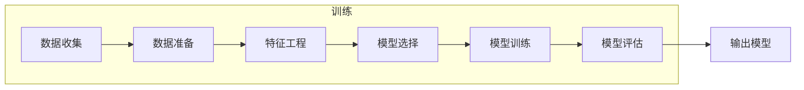
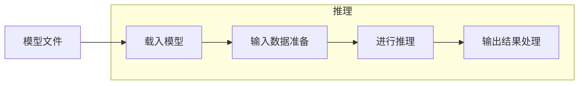
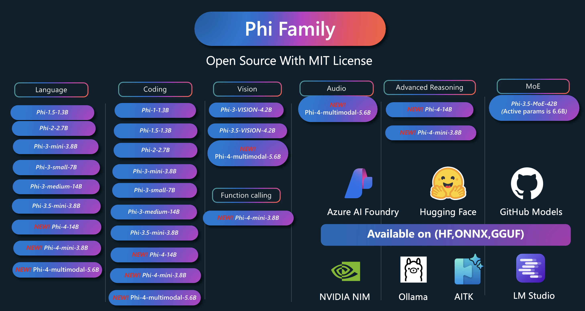

# .NET 平台上的开源模型训练与推理进展

作者：痴者工良

博客：https://www.whuanle.cn

## 一、 .NET AI 生态概述

### 背景介绍

.NET 生态系统已经成为支持多种编程语言、多种平台和大量开发工具的强大生态系统。最近几年，随着人工智能和机器学习的迅猛发展，.NET 平台也相应地发展出了一系列支持模型训练、推理和部署的工具和框架，这使得开发者能够在熟悉的 .NET 环境中更高效地进行 AI 应用开发。

### .NET AI 生态图

#### 深度学习框架（Deep Learning Frameworks）

##### ML.NET

支持: Microsoft 官方支持，成熟的项目，生态强势、社区活跃、应用广泛。

Star: `9.1k`

Github: [https://github.com/dotnet/machinelearning](https://github.com/dotnet/machinelearning)

ML.NET 是一个跨平台的开源机器学习框架，专为 .NET 开发者设计，提供丰富的工具和API，涵盖模型训练、评估和部署等整个流程，支持回归、分类、聚类及自然语言处理等多种任务，帮助开发者在熟悉的 .NET 环境中高效构建和优化 AI 解决方案。

##### TensorFlow.NET

支持: SciSharp 支持，成熟的项目，社区生态和应用领域都很好。

Star: `3.3k`

Github: [https://github.com/SciSharp/TensorFlow.NET](https://github.com/SciSharp/TensorFlow.NET)

TensorFlow.NET 的目标是在 C# 中实现全面的 TensorFlow API，便于 .NET 开发者开发、训练和部署跨平台的机器学习模型。

##### TorchSharp

支持: dotnet 开源社区支持，不成熟，生态较差、跟不上发展、应用领域太少、应用开发局限。

Star: `1.5k`

Github: [https://github.com/dotnet/TorchSharp](https://github.com/dotnet/TorchSharp)

TorchSharp 通过绑定 libtorch 实现利用与 Pytorch 类似功能的深度学习框架。

#### 机器学习和数据科学库（Machine Learning and Data Science Libraries）

##### MathNet.Numerics

支持: 社区支持，成熟稳定。

Star: `3.6k`

Github: https://github.com/mathnet/mathnet-numerics

NET Numerics 是 Math.NET 计划的数值基础，旨在为科学、工程和日常使用中的数值计算提供方法和算法。涵盖的主题包括特殊函数，线性代数，概率模型，随机数，统计，插值，积分，回归，曲线拟合，积分变换 (FFT) 等。

#### AI 推理平台和工具（AI Inference Platforms and Tools）

##### ONNX Runtime

支持: Microsoft 官方支持，成熟的项目，生态强势、社区活跃、应用广泛，支持 C#、C++、Python 等。

Star: `16k`

Github: https://github.com/microsoft/onnxruntime

ONNX 运行时是一个跨平台的推理和训练机器学习加速器，可以提供更快的客户体验和更低的成本，它能够通过灵活的接口集成特定硬件库，支持的模型包括来自 PyTorch、TensorFlow/Keras、TFLite 和 Scikit-Learn 等框架。

##### 其它

LLamaSharp: https://github.com/SciSharp/LLamaSharp

OllamaSharp: https://github.com/awaescher/OllamaSharp

#### AI SDK 和 框架（AI SDKs and Frameworks）

##### Semantic Kernel

社区：Microsoft 官方支持，生态非常好，功能强劲，支持 C#、Python 等语言。

Star: `23k`

Github: https://github.com/microsoft/semantic-kernel

Semantic Kernel是一个 SDK，它集成了大型语言模型 (LLM) ，如 OpenAI、 Azure OpenAI 和 Hugging Face。

##### kernel memory

社区：Microsoft 官方支持，生态较好，功能强劲。

Star: `1.8k`

Github: https://github.com/microsoft/kernel-memory

此存储库提供了特定 AI 和 LLM 应用场景中的 Memory 的最佳实践和参考实现，主要包括文档处理、内容检索、RAG 等能力。

#### AI 应用（AI Application）

AntSK : https://github.com/AIDotNet/AntSK

fast-wiki: https://github.com/AIDotNet/fast-wiki

## 二、TorchSharp

### TorchSharp简介

TorchSharp 是由 .NET 开源基金会主导开发的项目，旨在为 .NET 社区带来 PyTorch 类似的深度学习开发体验，目前主要在主要提供图像识别领域接口，在自然语言处理、语音识别和合成领域没有成熟的案例。

#### 为什么使用 PyTorch

* 目前 Pytorch 是 AI 社区中使用最广泛的深度学习框架，有强大的社区支持和丰富的资源，包括教程、示例和预训练模型。
* 拥有丰富的生态系统和工具，如 torchvision、torchaudio 和 torchtext，用于各种数据处理任务。
* Pytorch 拥有高度模块化和可扩展的设计，使其易于研究和开发。
* 与其他流行框架（如 TensorFlow、Onnx Runtime）的互操作性较强，方便迁移和集成。
* 深入的硬件支持，从 GPU 到 TPU，再到基于 AI 的专用加速器。
* 被许多世界顶尖的研究机构和工业界公司使用和认可，确保其前沿技术和稳定性。

https://huggingface.co/models

https://www.modelscope.cn/models

### Pytorch 和 TorchSharp 对比

##### Pytorch 能力

**计算机视觉**

`视觉检测跟踪`、`光学字符识别`、`人脸人体`、`视觉分类`、`视觉编辑`、`视觉分割`、`视觉生成`、`视觉表征`、`视觉评价`、`底层视觉`、`三维视觉`、`基础模型应用`、`自然语言处理`

**文本分类**

`文本生成`、`分词`、`命名实体识别`、`翻译`、`文本摘要`、`句子相似度`、`预训练`、`自然语言推理`、`文本纠错`、`文本向量`、`特征抽取`、`情感分析`、`关系抽取`、`零样本分类`、`表格问答`、`问答`、`词性标注`、`实体分类`、`序列标注`、`任务型对话`

**语音**

`语音识别`、`语音合成`、`语音唤醒`、`语音降噪`、`回声消除`、`语音分离`、`音频分类`、`音频生成`、`说话人确认`、`说话人日志`、`标点预测`、`时间戳预测`、`语音端点检测`、`困惑度计算`、`语音语种识别`、`音频量化编码`、`音视频语音识别`、`情绪识别`、`逆文本正则化`

##### 对比

Pytorch

- 计算机视觉（Computer Vision）
- 自然语言处理 (NLP)
- 生成型人工智能（Generative AI）
- 图形机器学习（Graph Machine Learning）

TorchSharp

* 计算机视觉（Computer Vision）
* 其它能力 TorchVision、TorchAudio、TorchScript 功能不完善，案例非常少。

### TorchSharp 进行模型训练的过程

### TorchSharp 案例

https://torch.whuanle.cn

> 深度学习基础知识和 TorchSharp 教程。

https://github.com/dotnet/TorchSharp/network/dependents

> 使用 TorchSharp 开的项目。

https://github.com/IntptrMax/YoloSharp

> 用 TorchSharp 实现 C # 中的 Yolo 模型，支持 yolov8、yolov11，可以直接使用 `.pt` 模型。

https://github.com/IntptrMax/StableDiffusionSharp/tree/master/StableDiffusionSharp

> 能够加载 StableDiffusion 的模型（safetensors 格式）并工具提示词生成图像。

### 未来展望

#### 计算机视觉

* 图像分类
* 目标检测和图像分割
* 物体追踪、人体（身体、面部、手势）分析
* 图像处理、图像生成

#### 语音及音频处理

这类模型使用音频数据来训练模型，这些模型可以识别声音、生成音乐。

* 语音识别
* 语音合成

#### 自然语言处理

大语言模型。

* 机器理解
* 机器翻译
* 语言建模

## 三、ML.NET简介

ONNX Runtime 是一个高性能推理引擎，用于执行通过 ONNX 格式表示的机器学习模型，提供数据处理、模型训练、模型评估和推理等功能，支持多种机器学习任务。

ML.NET 是一个开源的跨平台机器学习框架，专门为 .NET 开发者提供易用的工具和算法库来构建和部署机器学习模型。

### 

### 功能

* 分类（Classification）
* 回归（Regression）
* 聚类（Clustering）
* 推荐系统（Recommendation）
* 排序（Ranking）
* 异常检测（Anomaly Detection）
* 图像处理（Image Processing）
* 文本处理（Text Processing）
* 时间序列预测（Time Series Forecasting）

### 案例

#### ML.NET 官方示例

 官方仓库: [https://github.com/dotnet/machinelearning-samples](https://github.com/dotnet/machinelearning-samples)

1. **情绪分析**: 使用二进制分类算法分析客户评论情感。
2. **产品推荐**: 使用矩阵分解算法根据购买历史推荐产品。
3. **价格预测**: 使用回归算法预测出租车费用。
4. **客户细分**: 使用聚类分析算法识别客户组。
5. **目标检测**: 使用 ONNX 模型识别图像中的对象。
6. **欺诈检测**: 使用二进制分类算法检测欺诈交易。
7. **销售高峰检测**: 使用异常情况检测模型识别销售高峰。
8. **图像分类**: 使用 TensorFlow 模型对图像分类。
9. **销售预测**: 使用回归算法预测未来销量。

#### Phi 系列模型案例

项目地址: [https://github.com/microsoft/PhiCookBook](https://github.com/microsoft/PhiCookBook)

部署推理 Phi-4-mini-instruct-onnx 示例。

<video src="images/phi4-cpu.mp4"></video>

#### 基于 ML.NET 的开源项目

开源项目：

https://github.com/dme-compunet/YoloSharp

https://github.com/NickSwardh/YoloDotNet