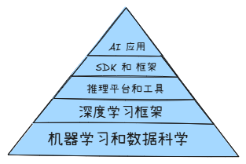
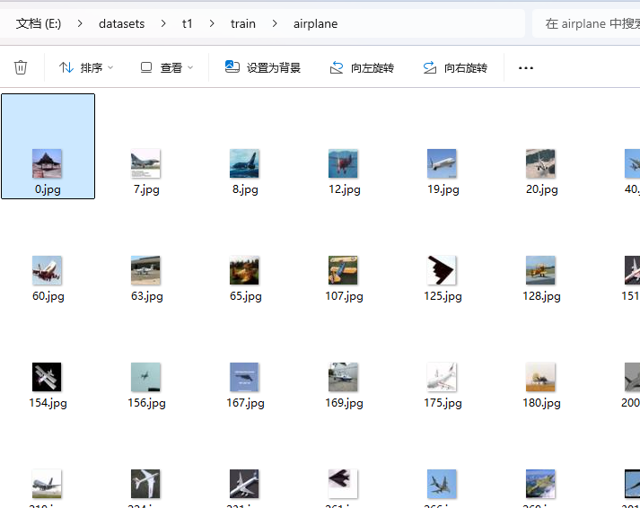

# .NET 平台上的开源模型训练与推理进展

作者：痴者工良

博客：https://www.whuanle.cn


## 一、 .NET AI 生态概述

### 背景介绍

.NET 生态系统已经成为支持多种编程语言、多种平台和大量开发工具的强大生态系统。最近几年，随着人工智能和机器学习的迅猛发展，.NET 平台也相应地发展出了一系列支持模型训练、推理和部署的工具和框架，这使得开发者能够在熟悉的 .NET 环境中更高效地进行 AI 应用开发。


### .NET AI 生态图




#### 机器学习和数据科学库（Machine Learning and Data Science Libraries）

##### MathNet.Numerics

支持: 社区支持，成熟稳定。

Star: `3.6k`

Github: https://github.com/mathnet/mathnet-numerics

NET Numerics 是 Math.NET 计划的数值基础，旨在为科学、工程和日常使用中的数值计算提供方法和算法。涵盖的主题包括特殊函数，线性代数，概率模型，随机数，统计，插值，积分，回归，曲线拟合，积分变换 (FFT) 等。


#### 深度学习框架（Deep Learning Frameworks）

##### ML.NET

支持: Microsoft 官方支持，成熟的项目，生态强势、社区活跃、应用广泛。

Star: `9.1k`

Github: [https://github.com/dotnet/machinelearning](https://github.com/dotnet/machinelearning)

ML.NET 是一个跨平台的开源机器学习框架，专为 .NET 开发者设计，提供丰富的工具和API，涵盖模型训练、评估和部署等整个流程，支持回归、分类、聚类及自然语言处理等多种任务，帮助开发者在熟悉的 .NET 环境中高效构建和优化 AI 解决方案。


##### TensorFlow.NET

支持: SciSharp 支持，成熟的项目，社区生态和应用领域都很好。

Star: `3.3k`

Github: [https://github.com/SciSharp/TensorFlow.NET](https://github.com/SciSharp/TensorFlow.NET)

TensorFlow.NET 的目标是在 C# 中实现全面的 TensorFlow API，便于 .NET 开发者开发、训练和部署跨平台的机器学习模型。


##### TorchSharp

支持: dotnet 开源社区支持，不成熟，生态较差、跟不上发展、应用领域太少、应用开发局限。

Star: `1.5k`

Github: [https://github.com/dotnet/TorchSharp](https://github.com/dotnet/TorchSharp)

TorchSharp 通过绑定 libtorch 实现利用与 Pytorch 类似功能的深度学习框架。


#### AI 推理平台和工具（AI Inference Platforms and Tools）

##### ONNX Runtime

支持: Microsoft 官方支持，成熟的项目，生态强势、社区活跃、应用广泛，支持 C#、C++、Python 等。

Star: `16k`

Github: https://github.com/microsoft/onnxruntime

ONNX 运行时是一个跨平台的推理和训练机器学习加速器，可以提供更快的客户体验和更低的成本，它能够通过灵活的接口集成特定硬件库，支持的模型包括来自 PyTorch、TensorFlow/Keras、TFLite 和 Scikit-Learn 等框架。


##### 其它

LLamaSharp: https://github.com/SciSharp/LLamaSharp

OllamaSharp: https://github.com/awaescher/OllamaSharp


#### AI SDK 和 框架（AI SDKs and Frameworks）

##### Semantic Kernel

社区：Microsoft 官方支持，生态非常好，功能强劲，支持 C#、Python 等语言。

Star: `23k`

Github: https://github.com/microsoft/semantic-kernel

Semantic Kernel是一个 SDK，它集成了大型语言模型 (LLM) ，如 OpenAI、 Azure OpenAI 和 Hugging Face。


##### kernel memory

社区：Microsoft 官方支持，生态较好，功能强劲。

Star: `1.8k`

Github: https://github.com/microsoft/kernel-memory

此存储库提供了特定 AI 和 LLM 应用场景中的 Memory 的最佳实践和参考实现，主要包括文档处理、内容检索、RAG 等能力。


#### AI 应用（AI Application）

AntSK : https://github.com/AIDotNet/AntSK

fast-wiki: https://github.com/AIDotNet/fast-wiki


## 二、TorchSharp

### TorchSharp简介

TorchSharp 是由 .NET 开源基金会主导开发的项目，旨在为 .NET 社区带来 PyTorch 类似的深度学习开发体验，目前主要在主要提供图像识别领域接口，在自然语言处理、语音识别和合成领域没有成熟的案例。


#### 为什么使用 PyTorch

* 目前 Pytorch 是 AI 社区中使用最广泛的深度学习框架，有强大的社区支持和丰富的资源，包括教程、示例和预训练模型。
* 拥有丰富的生态系统和工具，如 torchvision、torchaudio 和 torchtext，用于各种数据处理任务。
* Pytorch 拥有高度模块化和可扩展的设计，使其易于研究和开发。
* 与其他流行框架（如 TensorFlow、Onnx Runtime）的互操作性较强，方便迁移和集成。
* 深入的硬件支持，从 GPU 到 TPU，再到基于 AI 的专用加速器。
* 被许多世界顶尖的研究机构和工业界公司使用和认可，确保其前沿技术和稳定性。


在主流 AI 模型仓库中大多数 Pytorch 格式的模型。

https://huggingface.co/models

https://www.modelscope.cn/models


### Pytorch 和 TorchSharp 对比

##### Pytorch 能力

**计算机视觉**

`视觉检测跟踪`、`光学字符识别`、`人脸人体`、`视觉分类`、`视觉编辑`、`视觉分割`、`视觉生成`、`视觉表征`、`视觉评价`、`底层视觉`、`三维视觉`、`基础模型应用`、`自然语言处理`


**文本分类**

`文本生成`、`分词`、`命名实体识别`、`翻译`、`文本摘要`、`句子相似度`、`预训练`、`自然语言推理`、`文本纠错`、`文本向量`、`特征抽取`、`情感分析`、`关系抽取`、`零样本分类`、`表格问答`、`问答`、`词性标注`、`实体分类`、`序列标注`、`任务型对话`


**语音**

`语音识别`、`语音合成`、`语音唤醒`、`语音降噪`、`回声消除`、`语音分离`、`音频分类`、`音频生成`、`说话人确认`、`说话人日志`、`标点预测`、`时间戳预测`、`语音端点检测`、`困惑度计算`、`语音语种识别`、`音频量化编码`、`音视频语音识别`、`情绪识别`、`逆文本正则化`


##### 对比

Pytorch

- 计算机视觉（Computer Vision）
- 自然语言处理 (NLP)
- 生成型人工智能（Generative AI）
- 图形机器学习（Graph Machine Learning）

TorchSharp

* 计算机视觉（Computer Vision）
* 其它能力 TorchVision、TorchAudio、TorchScript 功能不完善，案例非常少。


### TorchSharp 进行模型训练的过程


#### 数据集

https://opendatalab.com/

```
├─test
│  ├─airplane
│  ├─automobile
│  ├─bird
│  ├─cat
│  ├─deer
│  ├─dog
│  ├─frog
│  ├─horse
│  ├─ship
│  └─truck
└─train
│  ├─airplane
│  ├─automobile
│  ├─bird
│  ├─cat
│  ├─deer
│  ├─dog
│  ├─frog
│  ├─horse
│  ├─ship
│  └─truck
```




#### 定义神经网络架构

根据需求设计神经网络架构或使用开源网络架构。

案例代码教程地址：https://torch.whuanle.cn/02.start/02.start_torch.html

```csharp
using TorchSharp.Modules;
using static TorchSharp.torch;
using nn = TorchSharp.torch.nn;

public class NeuralNetwork : nn.Module<Tensor, Tensor>
{
    // 传递给基类的参数是模型的名称
    public NeuralNetwork() : base(nameof(NeuralNetwork))
    {
        flatten = nn.Flatten();
        linear_relu_stack = nn.Sequential(
            nn.Linear(28 * 28, 512),
            nn.ReLU(),
            nn.Linear(512, 512),
            nn.ReLU(),
            nn.Linear(512, 10));

        // C# 版本需要调用这个函数，将模型的组件注册到模型中
        RegisterComponents();
    }

    Flatten flatten;
    Sequential linear_relu_stack;

    public override Tensor forward(Tensor input)
    {
        // 将输入一层层处理并传递给下一层
        var x = flatten.call(input);
        var logits = linear_relu_stack.call(x);
        return logits;
    }
}
```


TorchSharp 自带的网络架构：

```
alexnet
googlenet
inception_v3
mobilenet_v2
mobilenet_v3_large
mobilenet_v3_small
resnet18
resnet34
resnet50
wide_resnet50_2
resnext50_32x4d
resnet101
resnext101_32x8d
resnext101_64x4d
wide_resnet101_2
resnet152
vgg11
vgg11_bn
vgg13
vgg13_bn
vgg16
vgg16_bn
vgg19
vgg19_bn
```


#### 训练模型


```csharp
static void Train(DataLoader dataloader, NeuralNetwork model, CrossEntropyLoss loss_fn, SGD optimizer)
{
    var size = dataloader.dataset.Count;
    model.train();

    int batch = 0;
    foreach (var item in dataloader)
    {
        var x = item["data"];
        var y = item["label"];

        // 第一步
        // 训练当前图片
        var pred = model.call(x);

        // 通过损失函数得出与真实结果的误差
        var loss = loss_fn.call(pred, y);

        // 第二步，反向传播
        loss.backward();

        // 计算梯度并优化参数
        optimizer.step();

        // 清空优化器当前的梯度
        optimizer.zero_grad();

        // 每 100 次打印损失值和当前训练的图片数量
        if (batch % 100 == 0)
        {
            loss = loss.item<float>();

            // Pytorch 框架会在 x.shape[0] 存储当前批的位置
            var current = (batch + 1) * x.shape[0];

            Console.WriteLine("loss: {loss.item<float>(),7}  [{current,5}/{size,5}]");
        }

        batch++;
    }
}
```


### TorchSharp 案例

https://torch.whuanle.cn

> 深度学习基础知识和 TorchSharp 教程。


https://github.com/dotnet/TorchSharp/network/dependents

> 使用 TorchSharp 开的项目。


https://github.com/IntptrMax/YoloSharp

> 用 TorchSharp 实现 C # 中的 Yolo 模型，支持 yolov8、yolov11，可以直接使用 `.pt` 模型。


https://github.com/IntptrMax/StableDiffusionSharp/tree/master/StableDiffusionSharp

> 能够加载 StableDiffusion 的模型（safetensors 格式）并工具提示词生成图像。


### 未来展望

#### 计算机视觉

* 图像分类
* 目标检测和图像分割
* 物体追踪、人体（身体、面部、手势）分析
* 图像处理、图像生成

#### 语音及音频处理

这类模型使用音频数据来训练模型，这些模型可以识别声音、生成音乐。

* 语音识别
* 语音合成

#### 自然语言处理

大语言模型。

* 机器理解
* 机器翻译
* 语言建模


## 三、ML.NET简介

ONNX Runtime 是一个高性能推理引擎，用于执行通过 ONNX 格式表示的机器学习模型，提供数据处理、模型训练、模型评估和推理等功能，支持多种机器学习任务。

ML.NET 是一个开源的跨平台机器学习框架，专门为 .NET 开发者提供易用的工具和算法库来构建和部署机器学习模型。

优点：

* **易于集成** ：ML.NET 可以轻松集成到现有的 .NET 应用程序中，无需离开 .NET 环境。
* **跨平台支持** ：ML.NET 支持在 Windows、Linux 和 macOS 上运行，具备良好的跨平台兼容性。
* **对性能要求不高** ：ML.NET 针对性能进行了优化，可以在性能不高的环境中运行，适合各种应用场景。
* **CPU 和 GPU 支持** ：ML.NET 可以在 CPU 上运行，也可以利用 GPU 进行加速，适合不同硬件条件的应用。
* **嵌入式设备支持** ：ML.NET 可以在一些嵌入式设备上运行，提供更广泛的硬件兼容性。
* **扩展性** ：ML.NET 允许集成其它机器学习库（如 TensorFlow 和 ONNX），使得开发者可以使用最先进的机器学习技术。
* **自动化机器学习** ：ML.NET 包含 AutoML 功能，可以自动化地选择和调优模型，减少了机器学习过程中的人工干预。
* **丰富的算法支持** ：ML.NET 支持多种机器学习算法，包括分类、回归、聚类、推荐等多类型算法，满足不同的业务需求。
* **易于使用** ：提供了丰富的 API 和文档，开发者可以快速上手，学习曲线相对较低。
* **社区支持** ：作为一个开源项目，ML.NET 拥有一个活跃的社区，开发者可以获得支持并参与到项目的改进中。


### 功能

* 分类（Classification）
* 回归（Regression）
* 聚类（Clustering）
* 推荐系统（Recommendation）
* 排序（Ranking）
* 异常检测（Anomaly Detection）
* 图像处理（Image Processing）
* 文本处理（Text Processing）
* 时间序列预测（Time Series Forecasting）


### 案例

#### ML.NET 官方示例

 官方仓库:  https://github.com/dotnet/machinelearning-samples

1. **情绪分析**: 使用二进制分类算法分析客户评论情感。
2. **产品推荐**: 使用矩阵分解算法根据购买历史推荐产品。
3. **价格预测**: 使用回归算法预测出租车费用。
4. **客户细分**: 使用聚类分析算法识别客户组。
5. **目标检测**: 使用 ONNX 模型识别图像中的对象。
6. **欺诈检测**: 使用二进制分类算法检测欺诈交易。
7. **销售高峰检测**: 使用异常情况检测模型识别销售高峰。
8. **图像分类**: 使用 TensorFlow 模型对图像分类。
9. **销售预测**: 使用回归算法预测未来销量。


#### Phi 系列模型案例

项目地址: [https://github.com/microsoft/PhiCookBook](https://github.com/microsoft/PhiCookBook)


部署推理 Phi-4-mini-instruct-onnx （32B，int4 量化），CPU：AMD 8745H，内存 32GB。

| Hardware                           | ONNX                                                         | PyTorch                 | speedup  |
| ---------------------------------- | ------------------------------------------------------------ | ----------------------- | -------- |
| RTX 4090 GPU                       | int4: 260.045 tokens/sec fp16: 97.463 tokens/se fp32: 19.320 tokens/sec | fp16: 43.957 tokens/sec | 5x(fp16) |
| Intel Xeon Platinum 8272CL CPU     | int4: 16.89 tokens/sec                                       | fp32: 1.636 tokens/sec  | 10x      |
| Intel Xeon Platinum 8573B CPU      | int4: 23.978 tokens/sec                                      | fp32: 4.479 tokens/sec  | 5.35X    |
| AMD EPYC 7763v CPU                 | int4: 19.884 tokens/sec                                      | fp32: 1.599 tokens/sec  | 12.4x    |
| Intel Core Ultra 7 165H Laptop CPU | int4: 4.863 tokens/sec                                       | fp32: 1.699 tokens/sec  | 2.8x     |
| Intel i7 processor                 | int4: 3.474 tokens/sec fp32: 1.800 tokens/sec                | fp32: 0.702 tokens/sec  | 4.85x    |

<video src="images/phi4-cpu.mp4"></video>


#### 基于 ML.NET 的开源项目

开源项目：

https://github.com/gerardo-lijs/MachineLearning-ObjectDetect-WPF

https://github.com/dme-compunet/YoloSharp

https://github.com/NickSwardh/YoloDotNet