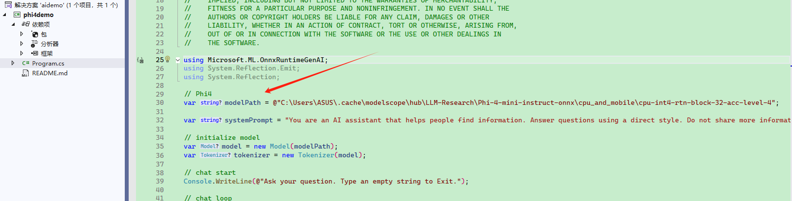

国内 microsoft/Phi-4-mini-instruct-onnx 模型库:

https://www.modelscope.cn/models/LLM-Research/Phi-4-mini-instruct-onnx

在下载前，请先通过如下命令安装ModelScope

```
pip install modelscope
```

命令行下载

下载完整模型库

```
modelscope download --model LLM-Research/Phi-4-mini-instruct-onnx
```


模型库位置

在资源管理器地址中输入：`%USERPROFILE%\.cache\modelscope\hub\LLM-Research`

或者在 powershell 中输入  `cd "$env:USERPROFILE\.cache\modelscope\hub\LLM-Research"`


